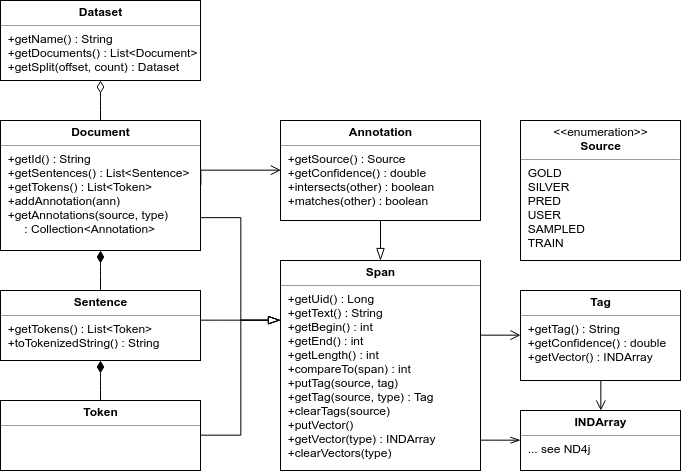

# TeXoo – A Zoo of Text Extractors

TeXoo is an tagging framework developed at DATEXIS, Beuth University of Applied Sciences Berlin. TeXoo comes with a NLP-style document model and a zoo of Deep Learning extraction models which you can access in texoo-models module. Here is a brief overview:


## Modules in TeXoo

### **texoo-core** – Document Model and Core Library

| Package / Class                             | Description                                   |
| ------------------------------------------- | --------------------------------------------- |
| **de.datexis.model**.*                      | TeXoo Document model (see below)              |
| **de.datexis.encoder**.*                    | Implementations of Bag-of-words, Word2Vec, Trigrams, etc. |
| de.datexis.preprocess.**DocumentFactory**   | Factory to create Document objects from text  |
| de.datexis.annotator.**AnnotatorFactory**   | Factory to create and load models from the zoo |
| de.datexis.common.**ObjectSerializer**      | Helper methods to import/export JSON          |
	
### **texoo-models** – Model Zoo implementations using Deeplearning4j

| Package / Class                               | Description / Reference                                                |
| --------------------------------------------- | ---------------------------------------------------------------------- |
| de.datexis.models.ner.**GenericMentionAnnotator** | Robust Named Entity Recognition (NER) with pre-trained models for English and German <http://arxiv.org/abs/1608.06757> |
| de.datexis.models.nel.**NamedEntityAnnotator**    | Named Entity Linking used in TASTY <https://www.aclweb.org/anthology/C/C16/C16-2024.pdf> |
| de.datexis.models.index.**ArticleIndexFactory**   | Knowledge Base implemented as local Lucene Index which imports Wikidata entities |
| de.datexis.models.sector.**SectorAnnotator**      | Topic Segmentation and Classification for Long Documents               |

### **texoo-examples** – Examples to Start your Implementation


## Installation and Usage

### Prerequisites

- **Docker** - run ```./install-docker.sh```
- Local (optional): **Oracle Java 8**
- Local (optional): **Apache Maven** Build system for Java  
<https://maven.apache.org/guides/index.html>

### Usage

This repository consists of different examples how to use TeXoo.

- Docker: start an interactive shell in the texoo container:  
`./run-docker.sh`
- Local: Run the example with maven:  
`cd texoo-examples && mvn exec:java -Dexec.mainClass=de.datexis.examples.AnnotateEntityRecognition`

## Documentation

### Frameworks used in TeXoo

- **Deeplearning4j** Machine learning library  
<http://deeplearning4j.org/documentation>
- **ND4J** Scientific computing library  
<http://nd4j.org/userguide>
- **Stanford CoreNLP** Natural language processing  
<http://stanfordnlp.github.io/CoreNLP/>

### TeXoo Data Model

<p align="center"></p>

### References

If you use this work, please cite:

Sebastian Arnold, Felix A. Gers, Torsten Kilias, Alexander Löser: Robust Named Entity Recognition in Idiosyncratic Domains. arXiv:1608.06757 [cs.CL] 2016

## License

   Copyright 2015-2018 Sebastian Arnold, Alexander Löser, Rudolf Schneider

   Licensed under the Apache License, Version 2.0 (the "License");
   you may not use this file except in compliance with the License.
   You may obtain a copy of the License at

       http://www.apache.org/licenses/LICENSE-2.0

   Unless required by applicable law or agreed to in writing, software
   distributed under the License is distributed on an "AS IS" BASIS,
   WITHOUT WARRANTIES OR CONDITIONS OF ANY KIND, either express or implied.
   See the License for the specific language governing permissions and
   limitations under the License.
